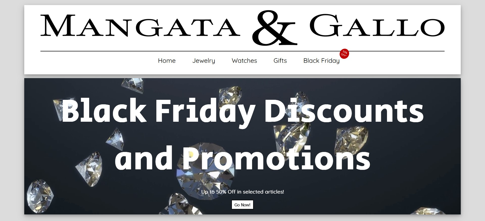
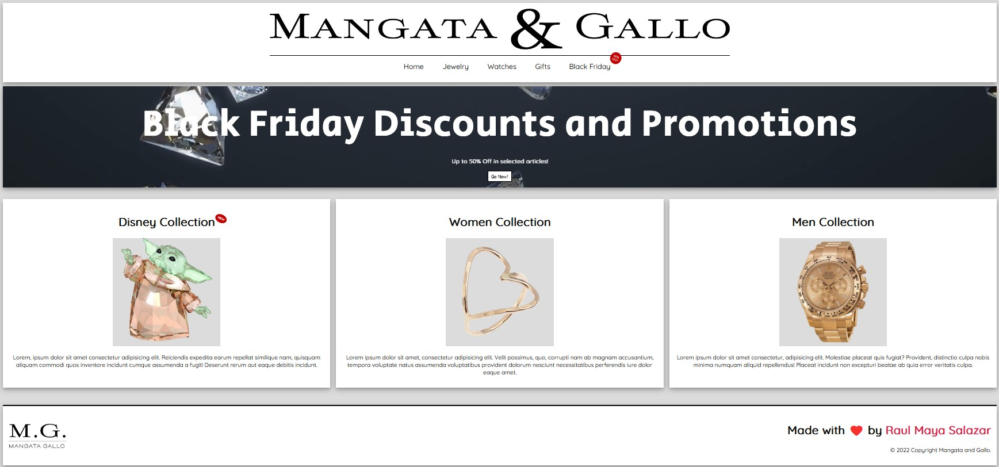

<!-- PROJECT LOGO -->
 

  

  <h2 align="center">Mangata & Gallo</h2>
  <h4 align="center">Landing Page </h4>

  

  This project was created using HTML and CSS, and is about a jewlery shop landing page. The intention of this project is to practice and gain skills and confidence using HTML and CSS.
     
     
    <a href="https://github.com/RaulMaya/Mangato-Gallo">Repository</a>    
    ·
    <a href="https://raulmaya.github.io/Mangato-Gallo/">Deployment</a>
    ·
    <a href="https://www.linkedin.com/in/raul-maya/">My LinkedIn</a>

  

<!-- ABOUT THE PROJECT -->

### About The Project

 

This project consists on a creating a landing page to a jewelry shop, using HTML, and advanced CSS. This page use CSS Effects, and animations, to give a more proffesional output to it.

 

 

### Contact :iphone:

- Name: Raul Maya Salazar
- Phone: +52 833 159 7006
- E-mail: raulmayas20@gmail.com
- GitHub: https://github.com/RaulMaya
- LinkedIn: https://www.linkedin.com/in/raul-maya/

(<a href="#top">back to top</a>)

